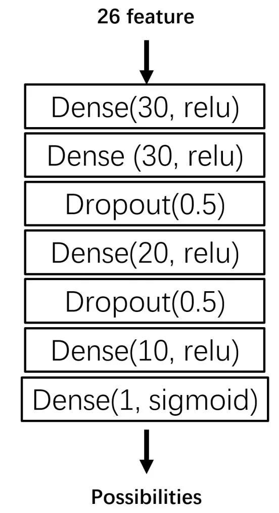

# 茂名市第一中学成绩分析系统

【原文链接：https://mp.weixin.qq.com/s/P0yg7c0aAXFfUY77LBtKHQ 】大三时做的一个小项目，不小心从u盘里翻出来了，传上来存着算了

（简单概括一下预测原理，16、17年的模拟考以及高考成绩的对应关系，扔进神经网络回归，据此规律，再根据18年的模拟考成绩，就可用于预测18年高考成绩）

最近看了一部电影，叫《点球成金》，说得是一个球队经理用数据的量把一个垃圾棒球队带到20连胜的故事。恰逢高考，我想着能不能基于数据去预测一下一中今年的成绩。

三年前，我班一个学霸提出一个“成绩结构理论”，指南以前发过，估计也没什么人看。这个理论是用模拟考的数据，计算出综合指标去体现一个人的综合实力。那一个人的综合实力和它高考成绩有紧密关系，也就是说，用模拟考的成绩去预测高考的成绩也是可行的。

花了九牛二虎之力，我委托哥们找到了一中以前的数据作为训练集。我使用的是16和17年的数据，18年的数据作为预测，因为15年还是广东卷，可能指导意义不大，因此15年以前的数据就不要了。

模拟考用的是四校（八校，每年不一样）联考、茂一模、广一模、广二模，没有广二模了，然后就用了茂二模代替。选用这几次考试都是因为他们比较近高考，更能反映你高考前的综合实力。

至于预测结果，我不打算预测准确的成绩，因为这会根据每一年考卷难度的不同导致成绩的不同，模型能够知道的只是大家的相对实力，因此这里预测的是两个指标：**上一本的概率以及上985大学的概率。**

然后有了训练集，接下来就是特征工程，也就是说让神经网络考虑什么样的指标，我用了以下25个指标（特征）：

**6科的全级排名：**

选用全级排名的原因很简单，排名反映了综合实力，而且即使试卷难度一直在变，但是排名相对是稳定的。

**6科相对优势：**

因为神经网络是算概率，如果只有排名，体现不出人与人之间到底差了多少分，所以要算相对优势。而这个相对优势是成绩结构理论定义出来的（下面放推文连接），简单来说就是全级不算这一科，新的排名和原本的排名差多少。举个例子，你原本的排名是118名，不算英语退了30名，也就是英语的相对优势为30，英语为你争取了30名的提升。

**6科的波动性：**

就是方差，每个人四次考试的方差。不知道哪里听来的数据，说高考考差的概率为40%，但是如果以综合实力的角度讲，成绩越不稳，综合实力应该是越低下，因此就更有可能考差。

**6科的综合分数和综合总分：**

就是四次大考平均数，本来我是不想放综合分的，觉得太依赖试题难度了。但是不用总分来预测的话，就是大家都算一中内的相对实力，这就是默认了一个假设：一中每年都考得一样好。回想了以下一中近几年的战绩，感觉不是很可能，所以想引入一个绝对数表现绝对实力。我回头看了一下三年的综合实力分，感觉大家都差不多，所以如果是三年，用一下总分好像也没太大毛病。

然后就是训练了，用的是keras来搭的神经网络。大概结构是这样的。

然后剩下的就是训练，用的是batch_gradient，损失函数用的是交叉熵，数据量没有很大就不用SGD了。

我手头上有4086个数据，打乱后按照八份拆开，7份用来训练，一份用于测试和验证。考上一本的训练验证集结果为：

**loss：0.400460922372**

**accuracy：0.822525618833**

损失值0.4，正确率82%，不算非常高。没算ROC。原因是除了开头讲的40%考差之外，更大的可能是数据比较脏。我手头上拿到的录取信息只有名字+录取大学，有一些大学既有一本又有二本，然后我也不知道它到底把他分在一本还是二本，所以就看以前的成绩分了一下。也有一些出国了的，没有高考成绩。还有很大部分有好几次模拟考有几科没成绩甚至全部都没成绩，很难搞，所以这就是数据很脏的原因。

对以前一个17级广工的朋友和某学霸cxz做判断，广工的朋友一本概率为43.17%，cxz的一本概率为99.48%，还算是比较合理。

接下来用同样的套路去搞985大学的概率，训练的验证集结果为：

**loss： 0.0904279990764**

**accuracy: 0.976109220306**

损失值0.09，正确率97.61%，没算ROC。看起来非常高，可能是因为985的人打label的时候比较方便，不会出现一个大学同时有一本和二本的情况。同时虽然正确率有97.61%，但我感觉ROC不会太高，因为我手头上的两年数据的985是非常不平衡的，4000+的样本才一百还是两百来个985，所以就算模型全部预测说都不是985的，也只有200/4000=5%的误差。所以也别问我为什么不做一下清北复交的预测了，那也得一中有人考得上才行啊。

不过在这个模型下，成绩差的985概率仍然无限接近0，成绩比较好的普遍都有五六十的概率，所以还是能在一定程度反映综合实力的。

预测985这个，想了想可能用xgboost更好一点，然而没有时间肝出来了QvQ。

**我给大家归纳一下模型缺陷：**

（1）**数据很脏**，尤其是一本的数据；985的数据非常不平衡。

（2）**网络不是最好的网络。**本来我是想用序列模型将时间因素考虑进去的，但是弄了两个星期没弄出来，最后就用比较基础的前馈网络。实际上，我也没有非常认真调过超参数，换了几下层数和神经元数，感觉结果差别不是很大，然后就挑了比较好的那个来用了。

（3）**加入总分因素也并不是非常能反映一中逐年的水平变化**，所以一中整体要是来个大跳水或者大成功，这个模型好像也没有什么指导意义了。

（4）**没有考虑个人因素**，比如高考那天姨妈来了、和女朋友分手了之类的

（5）准确来说，最后神经网路输出的那个玩意，其实不是概率，它应该是样本的模型符合率，只是通常来说它能被当作概率用。

（6）如果你得到了0概率，不是真的是0，而是精度只有小数点后五位，你的数值太小，所以被抹掉了。

**后记：**

整个想法成形到落地差不多花了3个星期，当然并没有三个星期整日整夜地做，工作量最大最枯燥的应该就是找数据和打label了，要一个个学校查它到底是不是一本，非常非常辛苦。

前两个星期是自己设计了一个网络，所有细节都搭了出来，没用工具包，后来发现整个网络一直在输出垃圾，还遇到了梯度消失的问题，非常恶心，最后放弃手打，还是用现成的库好了。

这个预测结果能有多大的可信度呢？反正它的确是很大程度反映了你的综合实力，这是你平时辛辛苦苦学习得来的。至于真的事实是不是这样，这个模型也没有非常合理，所以都是娱乐为主，高考成绩还是听天由命吧。
